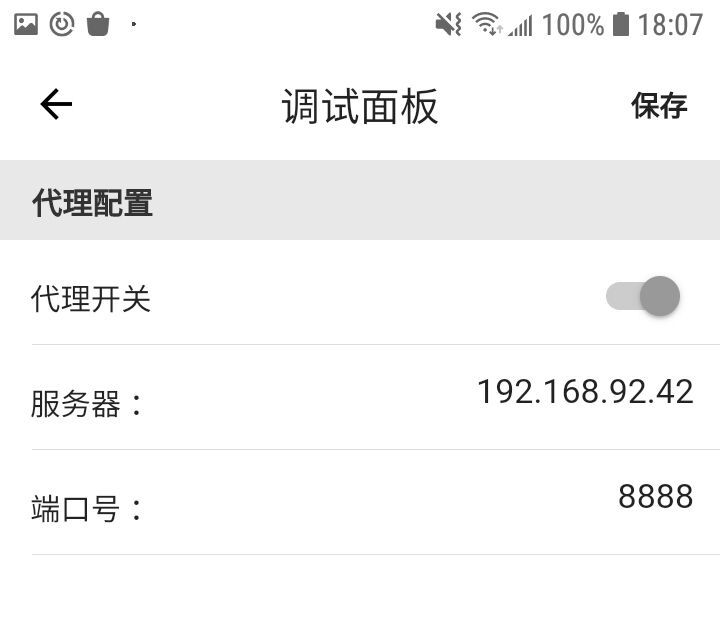

# debugkit

A new Flutter package project.

## Getting Started

This project is a starting point for a Dart
[package](https://flutter.dev/developing-packages/),
a library module containing code that can be shared easily across
multiple Flutter or Dart projects.

For help getting started with Flutter, view our 
[online documentation](https://flutter.dev/docs), which offers tutorials, 
samples, guidance on mobile development, and a full API reference.



1、dio 网络设置

```
static Future _proxySetting() async {
  var mgr = await DebugKitManager.getInstance();
  if (mgr.proxyEnabled) {
    (_dio.httpClientAdapter as DefaultHttpClientAdapter).onHttpClientCreate = (client) {
      client.findProxy = (uri) {
        return mgr.proxyUri;
      };
      client.badCertificateCallback = (X509Certificate cert, String host, int port) => true;
    };
  }
}
```

2、展示页面

```
IS_DEBUG ? TileItem(
    callback: () {
      Navigator.push(
        context,
        new MaterialPageRoute(
          builder: (context) => new DebugKitMainPage()),
      );
    },
    title: "调试面板"
) : Container(),
```


